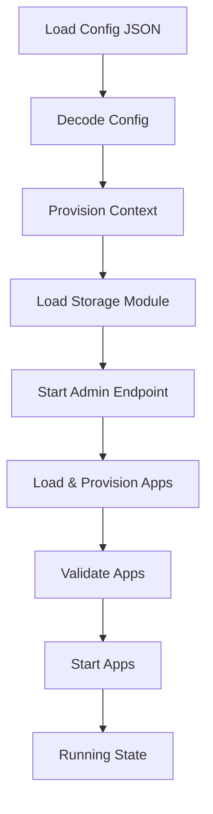

Caddy is built on a powerful, extensible architecture that emphasizes modularity, configuration flexibility, and automatic HTTPS. This page explains how Caddy's core components work together to deliver a production-ready web server.

## Core Architecture

Caddy's architecture revolves around several key concepts:

<Steps>
  <Step title="Config Structure">
    At the heart of Caddy is the `Config` struct, which represents the entire configuration:

    ```go caddy.go:68-95
    type Config struct {
        Admin   *AdminConfig `json:"admin,omitempty"`
        Logging *Logging     `json:"logging,omitempty"`

        // StorageRaw is a storage module that defines how/where Caddy
        // stores assets (such as TLS certificates)
        StorageRaw json.RawMessage `json:"storage,omitempty" caddy:"namespace=caddy.storage inline_key=module"`

        // AppsRaw are the apps that Caddy will load and run
        AppsRaw ModuleMap `json:"apps,omitempty" caddy:"namespace="`

        apps         map[string]App
        failedApps   map[string]error
        storage      certmagic.Storage
        eventEmitter eventEmitter
        cancelFunc   context.CancelFunc
        fileSystems  FileSystems
    }
    ```

    The configuration is natively expressed as JSON, but config adapters can convert other formats (like Caddyfile) into Caddy JSON.
  </Step>

  <Step title="App Module System">
    Caddy runs multiple **apps**, each responsible for a specific area of functionality:

    ```go caddy.go:98-101
    // App is a thing that Caddy runs.
    type App interface {
        Start() error
        Stop() error
    }
    ```

    Common apps include:
    - `http` - HTTP server and routing
    - `tls` - Certificate management and TLS configuration
    - `pki` - Internal PKI for local certificates
    - Custom apps via third-party modules
  </Step>

  <Step title="Context and Lifecycle">
    Each configuration has a `Context` that manages module lifecycles:

    ```go context.go:46-55
    type Context struct {
        context.Context

        moduleInstances map[string][]Module
        cfg             *Config
        ancestry        []Module
        cleanupFuncs    []func()
        exitFuncs       []func(context.Context)
        metricsRegistry *prometheus.Registry
    }
    ```

    The Context ensures proper provisioning, validation, and cleanup of all modules.
  </Step>
</Steps>

## Configuration Lifecycle

<Info>
Understanding the configuration lifecycle helps you debug issues and write better modules.
</Info>

When Caddy loads a configuration, it follows this precise sequence:



### Detailed Flow

From `caddy.go:389-468`, the `run()` function orchestrates the entire process:

<Accordion title="View the run() function logic">
```go
// 1. Create context and provision modules
ctx, err := provisionContext(newCfg, start)

// 2. Provision admin routers which may need access to other apps
err = ctx.cfg.Admin.provisionAdminRouters(ctx)

// 3. Start all apps
started := make([]string, 0, len(ctx.cfg.apps))
for name, a := range ctx.cfg.apps {
    err := a.Start()
    if err != nil {
        // Stop already-started apps on failure
        for _, otherAppName := range started {
            ctx.cfg.apps[otherAppName].Stop()
        }
        return fmt.Errorf("%s app module: start: %v", name, err)
    }
    started = append(started, name)
}
```
</Accordion>

<Warning>
If any app fails to start, Caddy stops all previously-started apps and cleans up provisioned modules to prevent resource leaks.
</Warning>

## Admin API

The Admin API provides runtime control over Caddy's configuration:

```go admin.go:67-86
type AdminConfig struct {
    // If true, the admin endpoint will be completely disabled
    Disabled bool `json:"disabled,omitempty"`

    // The address to which the admin endpoint's listener should bind itself
    // Default: localhost:2019
    Listen string `json:"listen,omitempty"`

    // If true, CORS headers will be emitted
    EnforceOrigin bool `json:"enforce_origin,omitempty"`

    // The list of allowed origins/hosts for API requests
    Origins []string `json:"origins,omitempty"`

    // Options pertaining to configuration management
    Config *ConfigSettings `json:"config,omitempty"`
}
```

### Key Admin Endpoints

| Endpoint | Method | Purpose |
|----------|--------|--------|
| `/config/` | GET | Read current configuration |
| `/config/` | POST/PUT/PATCH | Update configuration |
| `/config/` | DELETE | Remove config elements |
| `/stop` | POST | Gracefully stop Caddy |
| `/load` | POST | Load new config |

<Note>
The admin API uses **ETags** for optimistic concurrency control, preventing race conditions during config updates.
</Note>

## Storage System

Caddy uses a pluggable storage system for persisting TLS certificates and other assets:

```go caddy.go:530-550
// Set up global storage and make it CertMagic's default
if newCfg.StorageRaw != nil {
    val, err := ctx.LoadModule(newCfg, "StorageRaw")
    if err != nil {
        return fmt.Errorf("loading storage module: %v", err)
    }
    stor, err := val.(StorageConverter).CertMagicStorage()
    if err != nil {
        return fmt.Errorf("creating storage value: %v", err)
    }
    newCfg.storage = stor
}

if newCfg.storage == nil {
    newCfg.storage = DefaultStorage
}
certmagic.Default.Storage = newCfg.storage
```

The default storage is the file system, but you can use:
- Consul
- DynamoDB
- Redis
- Custom storage implementations

## Event System

Caddy has an event system for monitoring and reacting to changes:

```go caddy.go:1070-1092
type Event struct {
    // If non-nil, the event has been aborted
    Aborted error

    // The data associated with the event
    Data map[string]any

    id     uuid.UUID
    ts     time.Time
    name   string
    origin Module
}
```

Events are emitted for:
- Certificate renewals
- Server starts/stops  
- Config changes
- Custom module events

<Info>
Events are **experimental** and follow the CloudEvents specification for compatibility with external systems.
</Info>

## Configuration Autosave

Caddy automatically persists configurations that are pushed via the API:

```go caddy.go:362-384
if allowPersist &&
    newCfg != nil &&
    (newCfg.Admin == nil ||
        newCfg.Admin.Config == nil ||
        newCfg.Admin.Config.Persist == nil ||
        *newCfg.Admin.Config.Persist) {
    dir := filepath.Dir(ConfigAutosavePath)
    err := os.MkdirAll(dir, 0o700)
    if err != nil {
        Log().Error("unable to create folder for config autosave")
    } else {
        err := os.WriteFile(ConfigAutosavePath, cfgJSON, 0o600)
        if err == nil {
            Log().Info("autosaved config (load with --resume flag)")
        }
    }
}
```

This allows you to resume from the last working configuration after a restart.

## Graceful Reloads

One of Caddy's most powerful features is zero-downtime config reloads:

<Steps>
  <Step title="New Config Validation">
    The new configuration is fully validated before being applied.
  </Step>
  
  <Step title="Atomic Swap">
    The old and new contexts are swapped atomically:
    
    ```go caddy.go:353-356
    currentCtxMu.Lock()
    oldCtx := currentCtx
    currentCtx = ctx
    currentCtxMu.Unlock()
    ```
  </Step>
  
  <Step title="Graceful Shutdown">
    The old context is stopped asynchronously, allowing in-flight requests to complete.
  </Step>
</Steps>

<Warning>
If the new config fails to start, Caddy restores the old configuration state to maintain availability.
</Warning>

## Instance Identity

Each Caddy instance has a unique UUID stored persistently:

```go caddy.go:913-932
func InstanceID() (uuid.UUID, error) {
    appDataDir := AppDataDir()
    uuidFilePath := filepath.Join(appDataDir, "instance.uuid")
    uuidFileBytes, err := os.ReadFile(uuidFilePath)
    if errors.Is(err, fs.ErrNotExist) {
        uuid, err := uuid.NewRandom()
        if err != nil {
            return uuid, err
        }
        err = os.MkdirAll(appDataDir, 0o700)
        if err != nil {
            return uuid, err
        }
        err = os.WriteFile(uuidFilePath, []byte(uuid.String()), 0o600)
        return uuid, err
    }
    return uuid.ParseBytes(uuidFileBytes)
}
```

This UUID is used for:
- Cluster coordination
- Storage locking
- Distributed certificate management

## Best Practices

<Steps>
  <Step title="Use the Admin API">
    Prefer using the admin API for config changes rather than restarting the process.
  </Step>
  
  <Step title="Test Configs">
    Use `caddy validate` to test configurations before deploying them.
  </Step>
  
  <Step title="Monitor Events">
    Subscribe to Caddy events to track certificate renewals and config changes.
  </Step>
  
  <Step title="Backup Configs">
    Regularly backup your configuration and the autosave file.
  </Step>
</Steps>