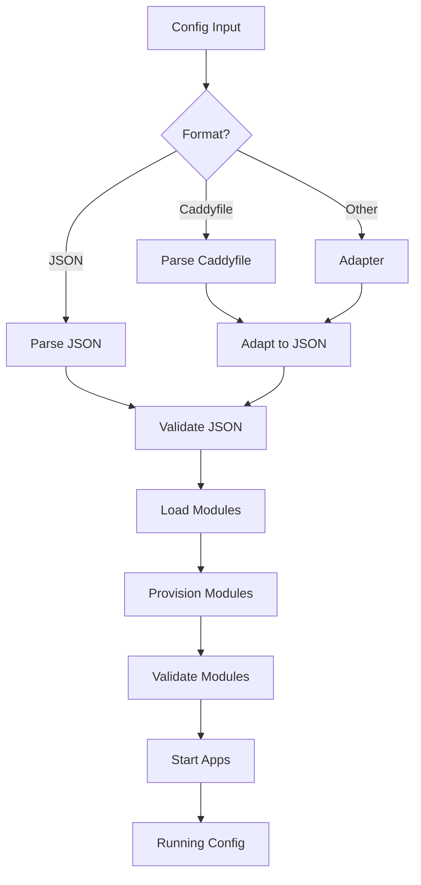

Caddy's configuration is built on a modular architecture with a clear hierarchy. Understanding this structure helps you effectively configure and extend Caddy.

## Architecture Overview

Caddy configuration follows a hierarchical structure:

```
Config (Root)
├── Admin          # API endpoint configuration
├── Logging        # Log configuration
├── Storage        # Asset storage (certificates, etc.)
└── Apps           # Application modules (HTTP, TLS, etc.)
    ├── HTTP
    ├── TLS
    └── PKI
```

## Root Configuration

From `caddy.go:46-95`, the top-level `Config` struct:

```go
type Config struct {
    Admin   *AdminConfig `json:"admin,omitempty"`
    Logging *Logging     `json:"logging,omitempty"`
    
    StorageRaw json.RawMessage `json:"storage,omitempty" 
               caddy:"namespace=caddy.storage inline_key=module"`
    
    AppsRaw ModuleMap `json:"apps,omitempty" caddy:"namespace="`
    
    apps         map[string]App
    failedApps   map[string]error
    storage      certmagic.Storage
    eventEmitter eventEmitter
    cancelFunc   context.CancelFunc
    fileSystems  FileSystems
}
```

<Note>
The `Config` struct contains both JSON-encodable fields (exported with json tags) and internal runtime fields (unexported). Only JSON fields are configurable.
</Note>

## Module System

Caddy's extensibility comes from its module system. Every feature is a module.

### Module Namespaces

Modules are organized into namespaces:

- `caddy.storage.*` - Storage backends
- `caddy.logging.writers.*` - Log writers  
- `caddy.logging.encoders.*` - Log encoders
- `http.handlers.*` - HTTP handlers
- `http.matchers.*` - Request matchers
- `tls.issuance.*` - Certificate issuers
- `tls.cert_managers.*` - Certificate managers

### Module Specification

Modules can be specified in two ways:

<Tabs>
  <Tab title="Inline Key">
    ```json
    {
      "storage": {
        "module": "file_system",
        "root": "/var/lib/caddy"
      }
    }
    ```
    
    The `module` field names the module, other fields are module-specific.
  </Tab>
  
  <Tab title="Module Map">
    ```json
    {
      "apps": {
        "http": { /* HTTP config */ },
        "tls": { /* TLS config */ }
      }
    }
    ```
    
    The object key is the module name, the value is the module config.
  </Tab>
</Tabs>

## App Lifecycle

From `caddy.go:98-101`, apps implement the `App` interface:

```go
type App interface {
    Start() error
    Stop() error
}
```

### Provisioning and Startup

The lifecycle follows this sequence (`caddy.go:403-468`):

1. **Provision Context** - Create execution environment
2. **Load Modules** - Instantiate all modules
3. **Provision Modules** - Call `Provision()` on each module
4. **Validate** - Verify configuration correctness
5. **Start Apps** - Call `Start()` on each app in order
6. **Finish Setup** - Configure admin endpoints, config loaders

```go
func run(newCfg *Config, start bool) (Context, error) {
    ctx, err := provisionContext(newCfg, start)
    if err != nil {
        globalMetrics.configSuccess.Set(0)
        return ctx, err
    }
    
    if !start {
        return ctx, nil
    }
    
    // Provision admin routers
    err = ctx.cfg.Admin.provisionAdminRouters(ctx)
    if err != nil {
        return ctx, err
    }
    
    // Start all apps
    for name, a := range ctx.cfg.apps {
        err := a.Start()
        if err != nil {
            // Stop already-started apps
            return ctx, fmt.Errorf("%s app module: start: %v", name, err)
        }
    }
    
    return ctx, nil
}
```

<Warning>
If any app fails to start, all previously-started apps are stopped to prevent partial states.
</Warning>

## Configuration Layers

### Layer 1: Native JSON

The foundational layer - Caddy's internal representation:

```json
{
  "apps": {
    "http": {
      "servers": {
        "srv0": {
          "listen": [":443"],
          "routes": [ /* ... */ ]
        }
      }
    }
  }
}
```

### Layer 2: Config Adapters

Adapters transform other formats to JSON:

<CodeGroup>

```caddyfile Caddyfile
localhost {
    respond "Hello, World!"
}
```

```yaml YAML (hypothetical)
http:
  servers:
    srv0:
      listen:
        - :443
      routes:
        - handle:
            - handler: static_response
              body: Hello, World!
```

```json Adapted JSON
{
  "apps": {
    "http": {
      "servers": {
        "srv0": {
          "listen": [":443"],
          "routes": [
            {
              "handle": [
                {
                  "handler": "static_response",
                  "body": "Hello, World!"
                }
              ]
            }
          ]
        }
      }
    }
  }
}
```

</CodeGroup>

From `caddyconfig/caddyfile/adapter.go:26-64`:

```go
type Adapter struct {
    ServerType ServerType
}

func (a Adapter) Adapt(body []byte, options map[string]any) ([]byte, []caddyconfig.Warning, error) {
    serverBlocks, err := Parse(filename, body)
    if err != nil {
        return nil, nil, err
    }
    
    cfg, warnings, err := a.ServerType.Setup(serverBlocks, options)
    if err != nil {
        return nil, warnings, err
    }
    
    result, err := json.Marshal(cfg)
    return result, warnings, err
}
```

### Layer 3: Admin API

Dynamic runtime configuration via HTTP API:

```bash
# Load complete config
POST /load

# Update partial config  
PATCH /config/apps/http/servers/srv0/listen

# Delete config section
DELETE /config/apps/http/servers/srv1
```

## Storage Architecture

Caddy stores persistent data like TLS certificates:

```go
type StorageConverter interface {
    CertMagicStorage() (certmagic.Storage, error)
}
```

Default storage locations:

| Platform | Default Path |
|----------|-------------|
| Linux | `$XDG_DATA_HOME/caddy` or `~/.local/share/caddy` |
| macOS | `~/Library/Application Support/Caddy` |
| Windows | `%AppData%\Caddy` |

<CodeGroup>

```json File System (Default)
{
  "storage": {
    "module": "file_system",
    "root": "/var/lib/caddy"
  }
}
```

```json Custom Storage
{
  "storage": {
    "module": "s3",
    "bucket": "my-caddy-storage",
    "region": "us-west-2"
  }
}
```

</CodeGroup>

## Context and Modules

From `context.go`, every module receives a `Context`:

```go
type Context struct {
    context.Context
    moduleInstances map[string][]Module
    cfg             *Config
    cleanupFuncs    []func()
}
```

Modules use context to:
- **Load other modules** via `ctx.LoadModule()`
- **Access configuration** via `ctx.cfg`
- **Register cleanup** via `ctx.OnCancel()`

### Module Interface

```go
type Module interface {
    CaddyModule() ModuleInfo
}

type Provisioner interface {
    Provision(Context) error
}

type Validator interface {
    Validate() error
}

type CleanerUpper interface {
    Cleanup() error
}
```

## Configuration Flow



## HTTP App Structure

The HTTP app is the most complex:

```json
{
  "apps": {
    "http": {
      "http_port": 80,
      "https_port": 443,
      "grace_period": "10s",
      "servers": {
        "server_name": {
          "listen": [":443"],
          "routes": [
            {
              "match": [ /* matchers */ ],
              "handle": [ /* handlers */ ],
              "terminal": false
            }
          ],
          "errors": { /* error handling */ },
          "tls_connection_policies": [ /* TLS config */ ],
          "automatic_https": { /* HTTPS automation */ },
          "logs": { /* server-specific logs */ }
        }
      }
    }
  }
}
```

### Route Matching

Routes are evaluated in order until a terminal route matches:

1. **Match** - Request matches all matchers (AND logic)
2. **Handle** - Handlers process the request
3. **Terminal** - Stop route evaluation if true

```json
{
  "routes": [
    {
      "match": [
        {"path": ["/api/*"]},
        {"method": ["POST", "PUT"]}
      ],
      "handle": [
        {"handler": "reverse_proxy", "upstreams": [{"dial": "localhost:3000"}]}
      ],
      "terminal": true
    },
    {
      "handle": [
        {"handler": "file_server", "root": "/var/www/html"}
      ]
    }
  ]
}
```

## TLS App Structure

```json
{
  "apps": {
    "tls": {
      "certificates": {
        "load_files": [
          {
            "certificate": "/path/to/cert.pem",
            "key": "/path/to/key.pem"
          }
        ],
        "automate": ["example.com"]
      },
      "automation": {
        "policies": [
          {
            "subjects": ["example.com"],
            "issuers": [
              {
                "module": "acme",
                "ca": "https://acme-v02.api.letsencrypt.org/directory"
              }
            ],
            "on_demand": false,
            "key_type": "rsa2048"
          }
        ],
        "on_demand": {
          "rate_limit": {
            "interval": "1m",
            "burst": 5
          }
        }
      },
      "session_tickets": {
        "disabled": false
      },
      "cache": {
        "capacity": 10000
      }
    }
  }
}
```

## Configuration Reloads

From `caddy.go:159-264`, config changes are atomic:

1. **Decode** new configuration
2. **Provision** new config (instantiate modules)
3. **Validate** new config
4. **Start** new apps
5. **Swap** to new config
6. **Stop** old apps
7. **Cleanup** old modules

```go
func changeConfig(method, path string, input []byte, ifMatchHeader string, forceReload bool) error {
    // Acquire lock to ensure only one config change at a time
    rawCfgMu.Lock()
    defer rawCfgMu.Unlock()
    
    // Modify config
    err := unsyncedConfigAccess(method, path, input, nil)
    if err != nil {
        return err
    }
    
    // Encode entire config as JSON
    newCfg, err := json.Marshal(rawCfg[rawConfigKey])
    if err != nil {
        return err
    }
    
    // If unchanged, skip reload unless forced
    if !forceReload && bytes.Equal(rawCfgJSON, newCfg) {
        return errSameConfig
    }
    
    // Load new config
    err = unsyncedDecodeAndRun(newCfg, true)
    if err != nil {
        // Restore old config on failure
        var oldCfg any
        json.Unmarshal(rawCfgJSON, &oldCfg)
        rawCfg[rawConfigKey] = oldCfg
        return fmt.Errorf("loading new config: %v", err)
    }
    
    // Success - update stored config
    rawCfgJSON = newCfg
    return nil
}
```

<Note>
Config reloads are zero-downtime. The old config keeps running until the new config is fully started and validated.
</Note>

## Auto-Save and Resume

From `caddy.go:362-384`, Caddy can persist configs:

```go
if allowPersist &&
    newCfg != nil &&
    (newCfg.Admin == nil ||
        newCfg.Admin.Config == nil ||
        newCfg.Admin.Config.Persist == nil ||
        *newCfg.Admin.Config.Persist) {
    
    err := os.WriteFile(ConfigAutosavePath, cfgJSON, 0o600)
    if err == nil {
        Log().Info("autosaved config", 
                  zap.String("file", ConfigAutosavePath))
    }
}
```

Resume saved config:

```bash
caddy run --resume
```

## Events System

From `caddy.go:1065-1156`, Caddy emits events:

```go
type Event struct {
    Aborted error
    Data    map[string]any
    id      uuid.UUID
    ts      time.Time
    name    string
    origin  Module
}
```

Built-in events:
- `started` - Emitted when config starts successfully
- `stopping` - Emitted when shutdown begins

<Note>
The events system is experimental and subject to change.
</Note>

## Best Practices

### Structure Your Config

1. **Separate concerns** - Use multiple apps appropriately
2. **Modularize** - Break large configs into smaller pieces
3. **Use adapters** - Write in the format that makes sense for your use case
4. **Validate early** - Check configs before deploying
5. **Monitor changes** - Track config changes in version control

### Performance Considerations

- **Route order matters** - Place common routes first
- **Use terminal routes** - Stop evaluation when match is found
- **Minimize matchers** - Fewer matchers = faster matching
- **Leverage caching** - Enable TLS session resumption, HTTP caching

### Security Considerations

- **Disable admin when not needed** - Reduce attack surface
- **Use enforce_origin** - Prevent CSRF on admin API
- **Validate TLS configs** - Ensure strong cipher suites
- **Protect storage** - Secure certificate storage with proper permissions

## Debugging Configuration

### View Current Config

```bash
# Via API
curl http://localhost:2019/config/ | jq

# Via CLI (with running instance)
caddy config --address localhost:2019
```

### Trace Config Loading

```bash
# Enable debug logging
caddy run --config config.json --adapter caddyfile --debug
```

### Validate Before Loading

```bash
# Validate JSON
caddy validate --config config.json

# Adapt and validate Caddyfile
caddy adapt --config Caddyfile --validate
```

## See Also

- [Caddyfile Format](/config/caddyfile) - Human-friendly configuration
- [JSON Format](/config/json) - Native configuration format
- [Admin API](/guides/api) - Runtime configuration management
- [HTTP Modules](/modules/http/server) - HTTP module documentation